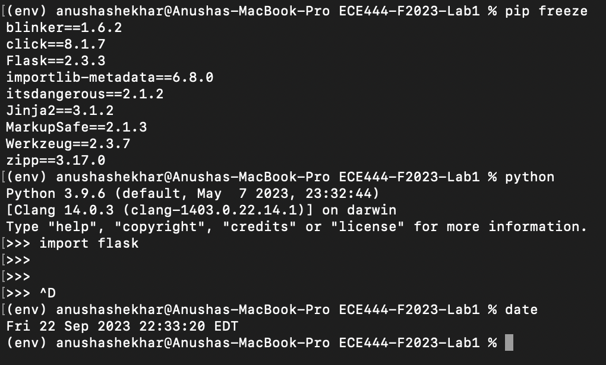

# Anusha Shekhar
Note: this is a clone of [this](https://github.com/miguelgrinberg/flask) repository.

## Activity 1
Below is a screenshot proving that I have successfully installed Flask in a virtual environment. 

## Activity 2