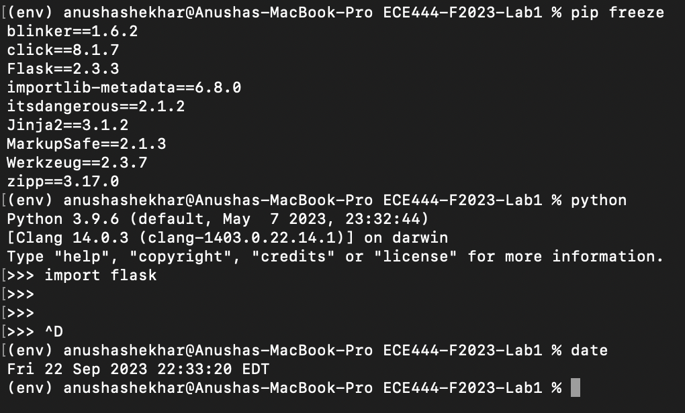
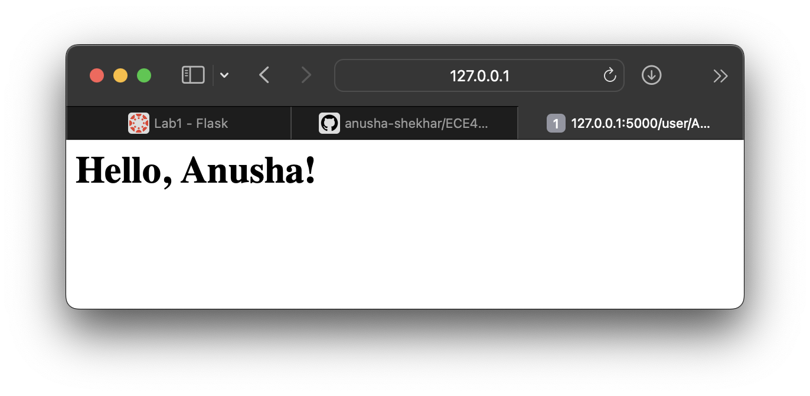
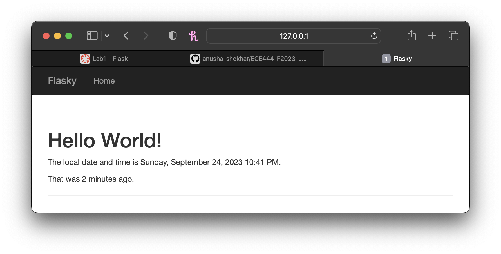
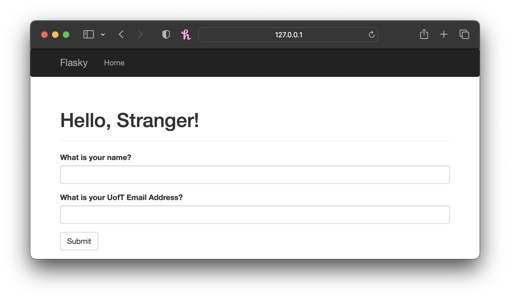
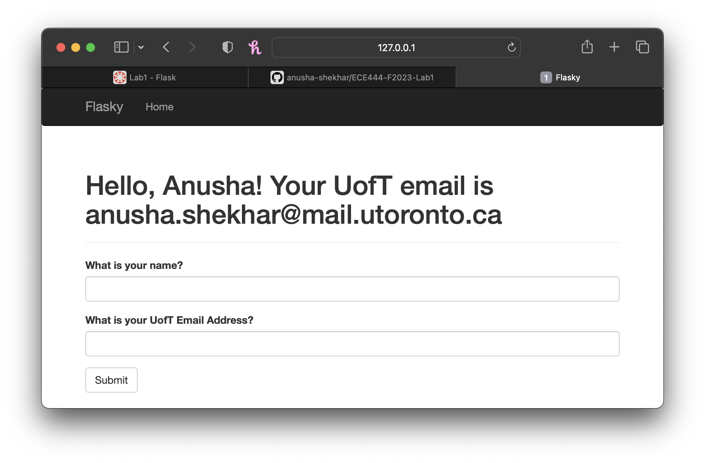
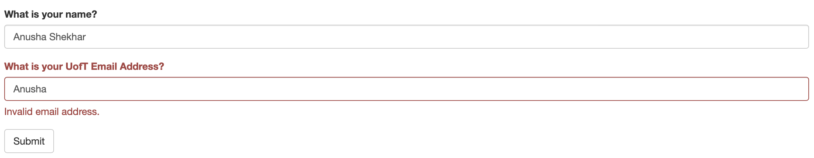

# Anusha Shekhar
Note: this is a clone of [this](https://github.com/miguelgrinberg/flask) repository.

## Activity 1
Below is a screenshot proving that I have successfully installed Flask in a virtual environment. 

## Activity 2
Below is a screenshot of my 'hello' HTML page with my name on the web page.

## Activity 3
Below is a screenshot showing that I have successfully finished the task of Activity 3.

**NOTE:** you will see a number of "fix images" commits after the commits for Activity 3. These were done as I was running into issues with the images. I initially uploaded an incorrect picture for the Activity 3 image, but when I modified it and re-committed, the image was not updating on GitHub (attempted twice). Hence, I decided to rename all the images and re-commit and re-push, which fixed the error.

## Activity 4

