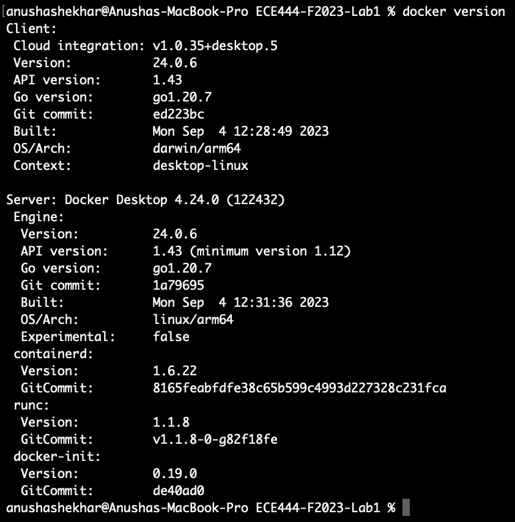
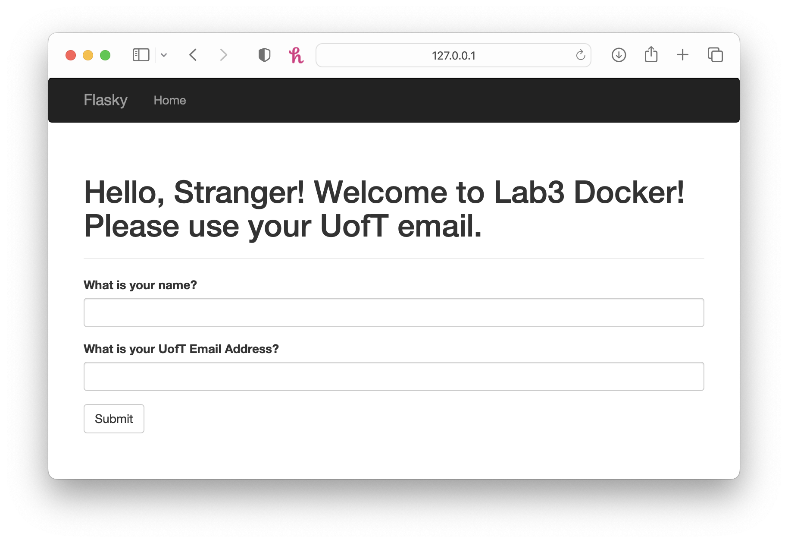
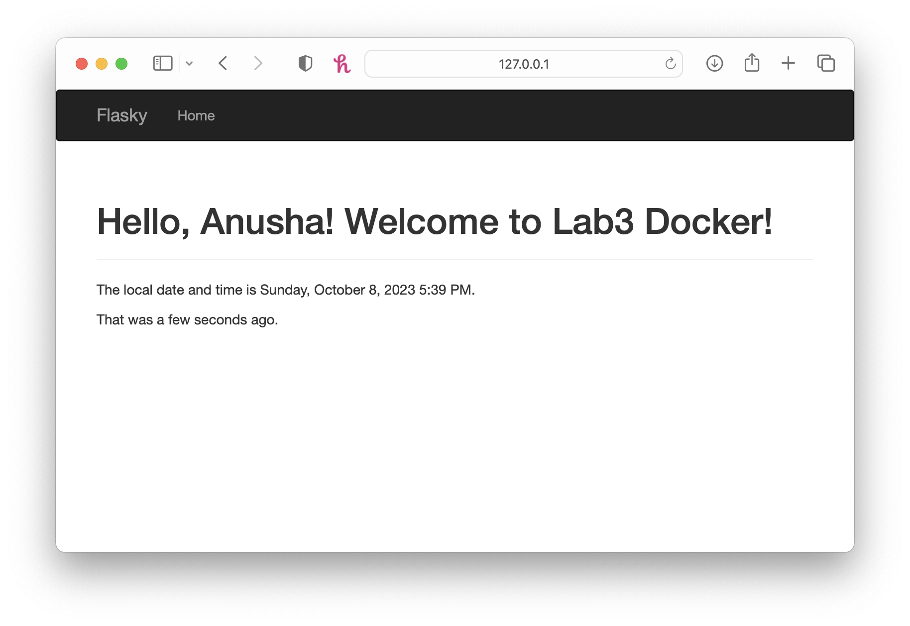
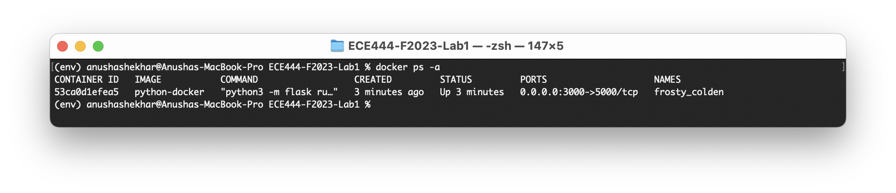
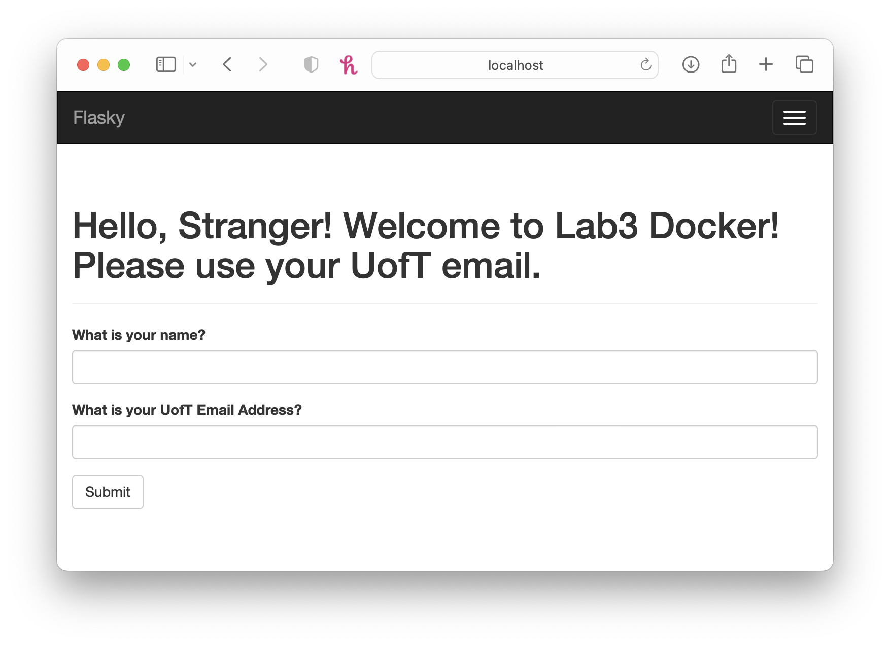

# Anusha Shekhar - Lab 3

## Activity 1
- A new branch named "lab3" has been created in my Lab1-Flask repo.
- The readme has been cleaned up and committed. 
- Branch "lab3" has been set as the default branch in my Lab1-Flask repo.

## Activity 2
- Docker has been installed.
- Below is a screenshot showing proof by printing the Docker version.

## Activity 3
- The project from Lab1-Flask has been modified as required.
- Below are two screenshots of the modified application running locally.

## Activity 4
- A Dockerfile and requirements.txt were added to the root folder of the repo.
- The docker image was built.
- Docker was run.
- Below is a screenshot of the log information indicating the running application.

- Below is a screenshot of the application running on the localhost.
